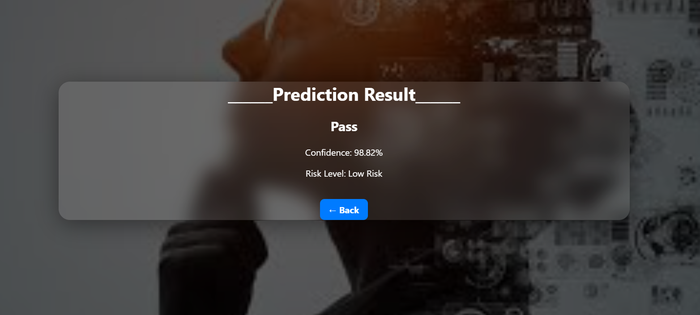

#  Student Performance Prediction System

This project predicts student performance based on:
- Attendance
- Midterm Marks
- Other academic inputs

## Features
- Clean UI with background styling
- Centered container layout
- Prediction output display
- Simple and user-friendly interface

## Technologies Used
- Python
- Flask
- HTML
- CSS

## Output Screenshot

##  Developed by
Ramapriya – B.Tech AI & DS